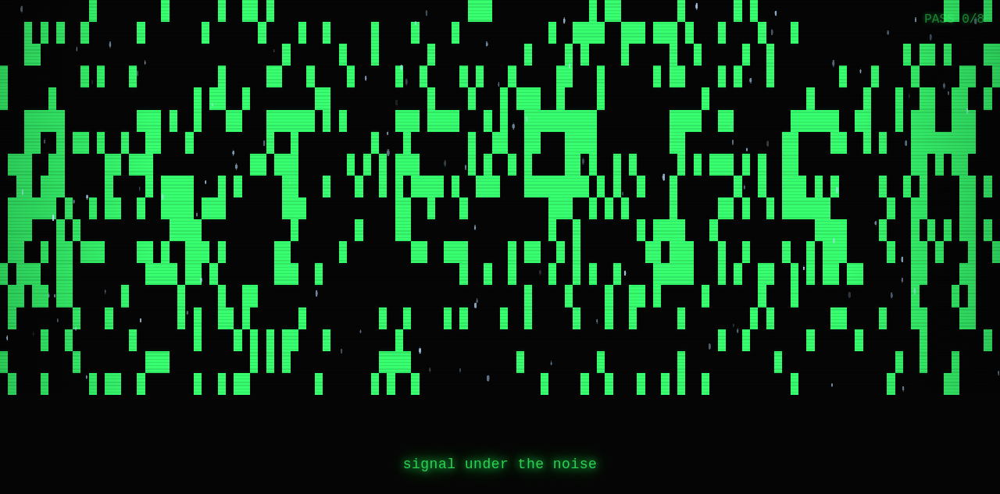
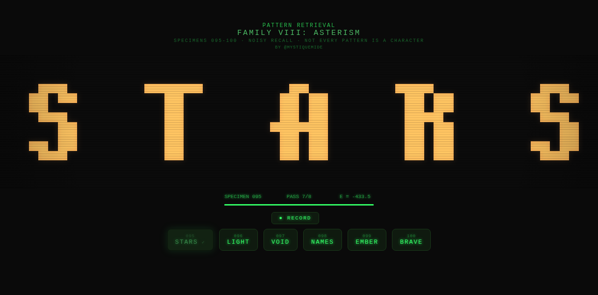

# Asterism

Asterism is a browser-based Pattern Retrieval remix by [@MystiqueMide](https://x.com/MystiqueMide).

It explores how structure emerges from noise through repeated recall passes, using Hopfield-style memory, pixel typography, CRT phosphor treatment, and a generative Web Audio score.

[Live demo](https://asterism-art.vercel.app)

## Product screens

| Landing | Standalone piece | Family VIII |
|---------|------------------|-------------|
|  |  |  |
| Entry screen for the collection | Signal Retrieved From Noise | 7-specimen Pattern Retrieval family |

## Why this exists

Pattern Retrieval turns noisy states into legible forms through recall. Asterism extends that feeling into a small word-based collection: signals are corrupted, pulled back through repeated passes, and left with visible residue instead of becoming perfectly clean.

The title points to a small recognizable pattern inside a larger field. In this piece, the field is noise, the pattern is a recovered signal, and the recovery process is the work.

## Features

- **7 specimens** (6 visible + 1 hidden): STARS, LIGHT, VOID, NAMES, EMBER, BRAVE, and the hidden ASTERISM
- **Hopfield-style recall**: 8 async recall passes with λ=0.35 bias
- **CRT treatment**: scanlines, phosphor glow, color drift, pixel rendering, and vignette
- **Generative score**: per-pass bleeps, corruption wash, and converge chime driven by retrieval state
- **Record to video**: built-in MediaRecorder captures the canvas as .webm
- **Hidden specimen 101**: unlocks after all 6 visible specimens are viewed
- **Energy display**: tracks the Hopfield energy as the network settles

## Quick Start

```bash
npm install
npm run dev
```

Open http://localhost:5173

## Pages

| Page | Description |
|------|-------------|
| `/` | Landing page |
| `/asterism.html` | Standalone piece: Signal Retrieved From Noise |
| `/family-viii.html` | Family VIII: 7 specimens with recording |

## Build

```bash
npm run build    # outputs to dist/
npm run preview  # preview the build
```

## What to test

- Open `/` and confirm the landing page frames the project as a Pattern Retrieval remix.
- Open `/asterism.html` and confirm the standalone piece retrieves ASTERISM from noise without personal-reference copy.
- Open `/family-viii.html`, click through specimens 095-100, then confirm hidden specimen 101 appears.
- Click `RECORD` on `/family-viii.html` and confirm a `.webm` file downloads.
- Check the browser console for errors on all three pages.

## Tech Stack

- Vanilla HTML/CSS/JS - no framework, no dependencies at runtime
- Canvas API - pixel rendering + CRT post-processing
- Web Audio API - generative recall score
- MediaRecorder API - specimen recording
- Vite - build tool for multi-page output

## Attribution

Built by [@MystiqueMide](https://x.com/MystiqueMide).

Inspired by [Pattern Retrieval](https://patternretrieval.app) by [Adam Ilenich](https://x.com/adamilenich). This is an independent remix exploring noisy recall, reconstruction, and emergent signal.

## License

MIT. See [LICENSE](LICENSE).
