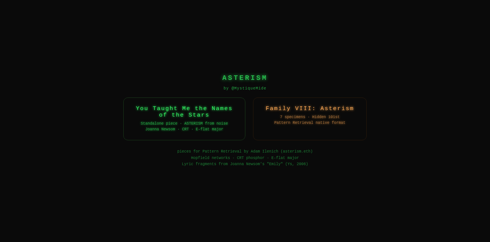

# Asterism

**Family VIII: Asterism** - an 8th family for [Pattern Retrieval](https://patternretrieval.app) by Adam Ilenich (asterism.eth). Hopfield networks retrieving words from noise. CRT phosphor treatment. E-flat major generative audio. Lyric fragments from Joanna Newsom's "Emily" (Ys, 2006).

[Live demo](https://asterism-art.vercel.app)



---

## Why this exists

Pattern Retrieval has 94 specimens across 7 families - all printable ASCII characters. This project adds an 8th family: words from "Emily," the Joanna Newsom song that gave Adam his ENS name. Every specimen is a memory retrieved from noise via Hopfield network, matching the original project's exact CRT parameters and recall mechanism.

The asterism connection: Adam's ENS name means "a recognizable star pattern pulled from the noise of the night sky." Pattern Retrieval is the exact same concept. This family bridges the two halves of his identity.

---

## Features

- **7 specimens** (6 visible + 1 hidden): STARS, LIGHT, VOID, NAMES, EMBER, BRAVE, and the hidden ASTERISM
- **Hopfield network**: 8 async recall passes with λ=0.35 bias, matching the original project exactly
- **CRT treatment**: barrel distortion (k=0.16), chromatic aberration (3.2px), scanlines (0.08→0.34), phosphor glow, vignette
- **Generative score**: E-flat major (the key of "Emily"), per-pass bleeps, corruption wash, converge chime
- **Record to video**: built-in MediaRecorder captures the canvas as .webm
- **Hidden specimen 101**: unlocks after all 6 are viewed - reveals "for asterism.eth - @MystiqueMide"
- **Energy display**: tracks the Hopfield energy as the network settles

## Product Screens


## Quick Start

```bash
npm install
npm run dev
```

Open http://localhost:5173

---

## Pages

| Page | Description |
|------|-------------|
| `/` | Landing page |
| `/asterism.html` | Standalone piece: "You Taught Me the Names of the Stars" |
| `/family-viii.html` | Family VIII: 7 specimens with recording |

---

## Build

```bash
npm run build    # outputs to dist/
npm run preview  # preview the build
```

---

## Tech Stack

- Vanilla HTML/CSS/JS - no framework, no dependencies at runtime
- Canvas API - pixel rendering + CRT post-processing
- Web Audio API - generative E-flat major score
- MediaRecorder API - specimen recording
- Vite - build tool for multi-page output

---

## Attribution

Built by [@MystiqueMide](https://x.com/MystiqueMide) for [asterism.eth](https://x.com/adamilenich).

Joanna Newsom, "Emily" - Ys (2006, Drag City).

---

## License

MIT. See [LICENSE](LICENSE).
